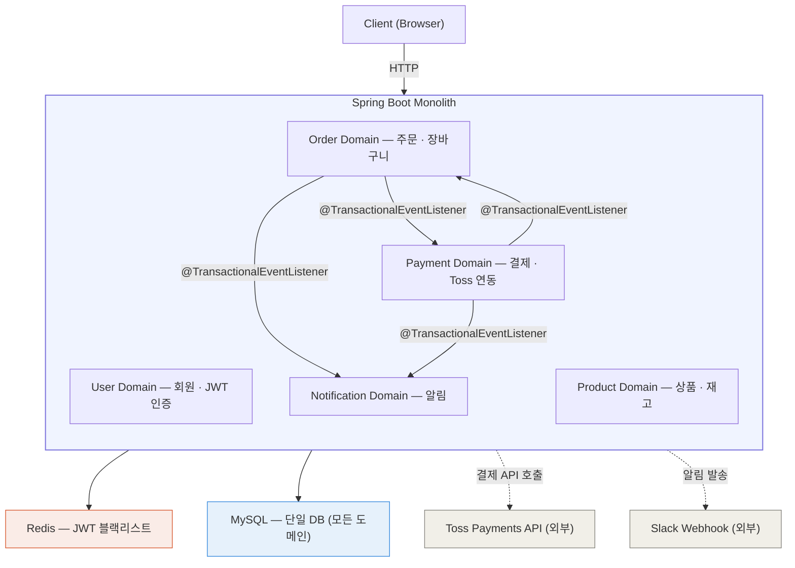
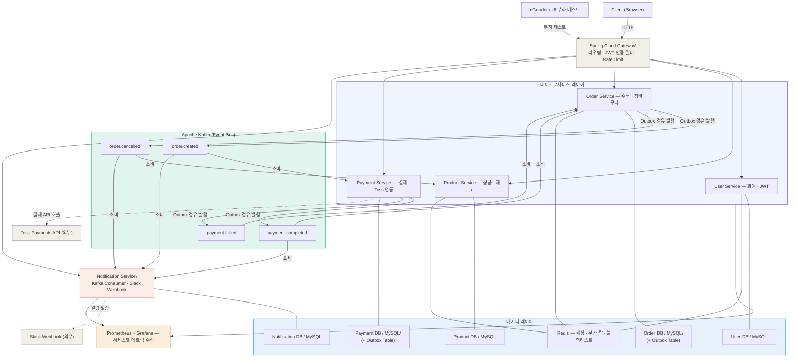

## 4. 아키텍처 방향

### 4-1. 코드 아키텍처: 4-Layered + DDD

각 도메인은 아래 4개 레이어로 구성됩니다.

| 레이어 | 패키지 | 역할 |
| --- | --- | --- |
| Presentation | `presentation/` | Controller, Request/Response DTO |
| Application | `application/` | UseCase, Command/Query 조율, 트랜잭션 경계 |
| Domain | `domain/` | Entity, VO, Domain Service, Repository 인터페이스 |
| Infrastructure | `infrastructure/` | Repository 구현체, Kafka, Redis, Toss 연동 |

> **핵심 원칙**: 비즈니스 로직은 Service가 아닌 Entity / Domain Service 안에 위치합니다.
**JPA 절충안**: 도메인 엔티티에 JPA 어노테이션(`@Entity`, `@Id`, `@Column` 등)을 허용하되, 비즈니스 로직은 JPA API(`EntityManager`, `Session` 등)에 의존하지 않습니다. Entity-Domain Entity 분리 + 매핑 레이어의 보일러플레이트를 피하면서도 도메인 순수성을 유지하는 실용적 절충안이며, 실무에서도 일반적인 접근 방식입니다.
>

### 4-2. 서비스 전략: 모놀리식 → MSA 분리

| 단계 | 구조 | 내용 |
| --- | --- | --- |
| Phase 1 | 모놀리식 | 단일 Spring Boot, 4-Layered + DDD, `@TransactionalEventListener` |
| Phase 2 | 성능 개선 | Redis 캐싱, Kafka + Outbox 패턴 도입, 재고 동시성 제어 |
| Phase 3 | 인프라 / 테스트 | K8s 배포, Prometheus + Grafana, 부하 테스트, HPA 검증 |
| Phase 4 | MSA 분리 | Gradle 멀티모듈, Spring Cloud Gateway, 서비스별 DB 분리 |

### 4-3. 인프라 전략: Kubernetes + Kustomize

- **Phase 1~2**: Docker Compose 로 MySQL/Redis/Kafka 만 컨테이너화, 앱은 로컬 실행
- **Phase 3 (Task 3-1 ~ 3-3)**: 로컬 minikube K8s 로 매니페스트/관측성 스택 초기 구축
- **Phase 3 (Task 3-4 ~ ) · Phase 4**: GCP / GKE 로 전환. 부하 테스트/HPA/MSA 운영
- **매니페스트 구조**: Kustomize `base/` + `overlays/{minikube, gke}/` (ADR-0005)
- **관측성 스택**: kube-prometheus-stack Helm 차트. base/ 와 분리된 `k8s/monitoring/` 트리에서 환경별로 관리 (ADR-0006). install.sh 로 멱등 설치
- HPA 로 Order Service Pod 자동 수평 확장 검증
- Liveness / Readiness / Startup Probe 설정으로 비정상 Pod 자동 재시작

> 환경 진화와 선택 근거의 상세: `docs/01-project-overview.md` §4 (SSOT), ADR-0004 (§Context 가 Phase 3 초기 minikube 근거 포함), ADR-0005, ADR-0006 (monitoring 스택 환경 분리).

### 4-4. 레포 전략: 모노레포 (Gradle 멀티모듈) (Phase 4 모듈 구조는 see ADR-0011)

- 단일 GitHub 레포에서 전체 서비스 구조를 한눈에 파악 가능
- `common` 모듈로 이벤트 DTO, 공통 예외, 응답 포맷 공유 + `peekcart-common-observability` 모듈(ADR-0009 선결정) + 5개 서비스 모듈 (경계·의존 규칙은 ADR-0011)
- 실무 기준에서는 서비스별 독립 배포와 권한 분리를 위해 멀티레포가 적합하나, 포트폴리오 가시성과 개발 효율을 위해 모노레포 채택

### 4-5. MSA 분리 대상 서비스 (see ADR-0010)

Phase 4 는 5개 도메인을 모두 독립 서비스로 분해한다 (경계·이벤트 토폴로지·Saga 골격의 SSOT 는 ADR-0010). 각 서비스의 분리 동기:

- **User Service** — 회원·JWT 인증/인가 (Gateway 인증 경로의 기반)
- **Product Service** — 상품·카테고리·**재고 소유자**, CQRS 로컬 캐시용 Product→Order 캐시 이벤트의 발행처 (이벤트 명칭·스키마는 A3 확정)
- **Order Service** — 주문 폭주 시 독립 스케일아웃 필요
- **Payment Service** — 결제 플로우 격리, 장애 전파 방지
- **Notification Service** — Kafka Consumer + Slack 발송, 알림 영속(Notification DB 소유)

---

## 5. 시스템 아키텍처 다이어그램

### Phase 1 — 모놀리식



> Phase 1에서는 Prometheus+Grafana를 사용하지 않습니다 (Phase 3에서 도입).
Redis는 JWT 블랙리스트 용도로만 사용합니다. 캐싱과 분산 락은 Phase 2에서 도입합니다.
>

### Phase 4 — MSA

> 5개 서비스 경계·이벤트 토폴로지·Saga 골격의 정본은 ADR-0010 (see ADR-0010).



---

## 12. 패키지 구조

> Phase 4 Gradle 멀티모듈 구조(`common` + `peekcart-common-observability` + 5개 서비스 모듈)·의존 규칙은 ADR-0011 (see ADR-0011). 아래는 Phase 1 모놀리식 패키지 구조.

### Phase 1 — 모놀리식 (4-Layered + DDD)

```
peekcart/
├── build.gradle
├── settings.gradle
├── docker-compose.yml
│
└── src/main/java/com/peekcart/
    ├── PeekCartApplication.java
    │
    ├── user/
    │   ├── presentation/
    │   │   ├── UserController.java
    │   │   ├── request/
    │   │   └── response/
    │   ├── application/
    │   │   ├── UserCommandService.java
    │   │   ├── UserQueryService.java
    │   │   ├── AuthService.java
    │   │   └── dto/
    │   ├── domain/
    │   │   ├── User.java               # Entity + 비즈니스 로직
    │   │   ├── RefreshToken.java
    │   │   ├── Address.java
    │   │   ├── UserRole.java           # VO (Enum)
    │   │   └── UserRepository.java     # 인터페이스만 선언
    │   └── infrastructure/
    │       ├── UserRepositoryImpl.java
    │       ├── UserJpaRepository.java
    │       └── redis/
    │           └── TokenBlacklistRepository.java  # 블랙리스트 전용
    │
    ├── product/
    │   ├── presentation/
    │   ├── application/
    │   │   ├── ProductCommandService.java
    │   │   ├── ProductQueryService.java
    │   │   └── InventoryService.java
    │   ├── domain/
    │   │   ├── Product.java
    │   │   ├── Category.java
    │   │   ├── Inventory.java          # version 필드 (낙관적 락)
    │   │   └── ProductStatus.java      # VO (Enum)
    │   └── infrastructure/
    │
    ├── order/
    │   ├── presentation/
    │   ├── application/
    │   │   ├── OrderCommandService.java
    │   │   ├── OrderQueryService.java
    │   │   └── CartService.java
    │   ├── domain/
    │   │   ├── Order.java              # 주문 상태 전이 로직 포함
    │   │   ├── OrderItem.java
    │   │   ├── OrderStatus.java        # VO (Enum)
    │   │   └── OrderRepository.java
    │   └── infrastructure/
    │       └── event/
    │           └── OrderEventListener.java  # @TransactionalEventListener
    │
    ├── payment/
    │   ├── presentation/
    │   ├── application/
    │   │   ├── PaymentCommandService.java
    │   │   └── PaymentQueryService.java
    │   ├── domain/
    │   │   ├── Payment.java
    │   │   ├── PaymentStatus.java      # VO (Enum)
    │   │   └── PaymentRepository.java
    │   └── infrastructure/
    │       ├── toss/
    │       │   └── TossPaymentClient.java
    │       └── event/
    │           └── PaymentEventListener.java  # @TransactionalEventListener
    │
    ├── notification/
    │   ├── presentation/
    │   │   └── NotificationController.java
    │   ├── application/
    │   │   ├── NotificationCommandService.java
    │   │   ├── NotificationQueryService.java
    │   │   └── port/
    │   │       └── SlackPort.java              # Slack 발송 포트 인터페이스
    │   ├── domain/
    │   │   ├── Notification.java
    │   │   └── NotificationType.java           # VO (Enum)
    │   └── infrastructure/
    │       ├── event/
    │       │   └── NotificationEventListener.java  # @TransactionalEventListener
    │       └── slack/
    │           └── SlackNotificationClient.java  # SlackPort 구현체
    │
    └── global/
        ├── config/
        │   ├── SecurityConfig.java
        │   └── RedisConfig.java
        ├── exception/
        │   ├── GlobalExceptionHandler.java
        │   ├── ErrorCode.java
        │   └── BusinessException.java
        ├── jwt/
        │   ├── JwtProvider.java
        │   └── JwtFilter.java
        └── response/
            └── ApiResponse.java
```

### Phase 2 — 패키지 변경점 (Delta)

Phase 2에서 Kafka + Outbox 패턴 도입에 따라 아래 패키지/클래스가 추가됩니다.

```
변경 사항:
│
├── order/
│   └── infrastructure/
│       ├── outbox/
│       │   └── OrderOutboxEventPublisher.java  # 비즈니스 트랜잭션 내 Outbox 저장 (NEW)
│       ├── kafka/
│       │   └── OrderEventConsumer.java         # payment.completed/failed 소비 (NEW)
│       └── event/
│           └── OrderEventListener.java         # Phase 1 유지 (Kafka 대체 대상)
│
├── payment/
│   └── infrastructure/
│       ├── outbox/
│       │   └── PaymentOutboxEventPublisher.java  # 비즈니스 트랜잭션 내 Outbox 저장 (NEW)
│       └── kafka/
│           └── PaymentEventConsumer.java       # order.created 소비 (NEW)
│
├── notification/
│   └── infrastructure/
│       └── kafka/
│           └── NotificationConsumer.java       # Kafka Consumer로 전환 (NEW)
│
└── global/
    ├── config/
    │   ├── CacheConfig.java                 # RedisCacheManager, TTL, 직렬화 (NEW)
    │   ├── KafkaConfig.java                 # Producer/Consumer/Topic 설정 (NEW)
    │   └── RedissonConfig.java              # Redisson 분산 락 설정 (NEW)
    ├── lock/                               # 분산 락 (NEW)
    │   └── DistributedLockManager.java     # Redisson 기반 락 관리자 (NEW)
    ├── kafka/
    │   ├── FixedSequenceBackOff.java       # 고정 시퀀스 BackOff 구현체 (NEW)
    │   ├── KafkaMessageParser.java         # Consumer 메시지 파싱 유틸리티 (NEW)
    │   ├── KafkaTraceHeaders.java          # Producer/Consumer trace 헤더 키 (D-007)
    │   ├── MdcRecordInterceptor.java       # Consumer MDC 주입 (D-007)
    │   ├── MdcPayloadExtractor.java        # payload 에서 traceId/userId/orderId 추출 (D-007)
    │   └── MdcSnapshot.java                # Outbox publisher 의 MDC 캡처 헬퍼 (D-010)
    ├── idempotency/
    │   ├── ProcessedEvent.java              # 중복 소비 방지 엔티티 (NEW)
    │   ├── ProcessedEventRepository.java    # 인터페이스 (NEW)
    │   ├── ProcessedEventJpaRepository.java # JPA Repository (NEW)
    │   ├── ProcessedEventRepositoryImpl.java # 구현체 (NEW)
    │   └── IdempotencyChecker.java          # 멱등성 처리기 — save-first + UK 선점 (NEW)
    └── outbox/
        ├── OutboxEvent.java                 # 횡단 관심사 — 단일 엔티티 (NEW)
        ├── OutboxEventRepository.java       # 단일 Repository (NEW)
        └── OutboxPollingScheduler.java      # Outbox Polling → Kafka 발행 (NEW)
```

### 레이어 책임 원칙

| 레이어 | 의존 방향 | 핵심 원칙 |
| --- | --- | --- |
| Presentation | → Application | DTO 변환만 담당, 비즈니스 로직 없음 |
| Application | → Domain | 트랜잭션 경계, UseCase 조율 |
| Domain | 없음 | JPA 어노테이션 허용, JPA API 미의존, 순수 비즈니스 로직 |
| Infrastructure | → Domain | Repository 인터페이스 구현, 외부 연동 |

### Phase 3 — 인프라 매니페스트 (Kustomize base/overlays)

Phase 3 에서 K8s 를 도입하면서 `k8s/` 디렉토리가 추가됩니다. Kustomize 의 `base/` + `overlays/` 패턴을 사용하여 환경(minikube / GKE)별 차이를 patch 로 분리합니다. 선택 근거는 ADR-0005.

```
peekcart/
├── src/                              # Phase 1·2 에서 구축된 애플리케이션 코드
├── docker-compose.yml                # 로컬 개발용 (Phase 1·2 이후에도 유지)
│
└── k8s/
    ├── base/                         # 환경 무관 공통 매니페스트 (ADR-0005, ADR-0006)
    │   ├── namespace.yml             # peekcart NS 만 (monitoring NS 는 k8s/monitoring/ 소관)
    │   ├── infra/                    # Phase 3 단순화: 디렉토리당 단일 통합 파일
    │   │   ├── mysql/mysql.yml       # Deployment + Service + PVC
    │   │   ├── redis/redis.yml
    │   │   └── kafka/kafka.yml
    │   ├── services/
    │   │   └── peekcart/             # Phase 3: 모놀리스 단일 서비스
    │   │       ├── deployment.yml    # Deployment + Service 통합 (환경 비종속)
    │   │       ├── configmap.yml
    │   │       ├── secret.yml
    │   │       └── servicemonitor.yml  # 앱이 자기 메트릭을 노출하는 방법 (peekcart NS, ADR-0006 불변식 2)
    │   └── kustomization.yml         # base 전체를 한 곳에서 집계
    ├── overlays/
    │   ├── minikube/                 # Phase 3 Task 3-1~3-3 로컬 검증 (ADR-0004 §Context)
    │   │   ├── kustomization.yml
    │   │   └── patches/              # imagePullPolicy: Never, Service type: NodePort 등
    │   └── gke/                      # 부하 테스트 / 운영 (ADR-0004)
    │       ├── kustomization.yml     # patches + images (PROJECT_ID placeholder) + hpa.yml
    │       ├── README.md             # 이미지 운반 / PROJECT_ID 치환 / 정리 절차
    │       ├── hpa.yml               # HorizontalPodAutoscaler (autoscaling/v2, CPU 60%, min=1/max=3) — Task 3-5 선행
    │       └── patches/              # peekcart Service LB(Internal), Deployment 리소스 상향, PVC standard-rwo
    └── monitoring/                   # base/ 분리된 관측성 스택 (ADR-0006)
        ├── namespace.yml             # monitoring NS SSOT (불변식 5)
        ├── shared/                   # 환경 무관 자원
        │   ├── kustomization.yml        # `kubectl apply -k` 진입점. configMapGenerator 가 *.json → ConfigMap 생성 (SSOT=JSON)
        │   ├── grafana-alerts.yml       # Grafana alert provisioning ConfigMap
        │   └── *.json                   # 대시보드 SSOT (standalone 편집 원본, ConfigMap 은 kustomize 산출물)
        ├── minikube/
        │   ├── values-prometheus.yml     # NodePort 30030, retention 6h, 경량 limits
        │   └── install.sh                # helm upgrade --install (멱등)
        └── gke/
            ├── values-prometheus.yml     # Internal LB, retention 24h, PVC standard-rwo 5Gi
            └── install.sh                # helm upgrade --install (멱등)
```

- **최초 배포 순서 (fresh 클러스터, minikube 기준)**:
  1. `kubectl apply -f k8s/monitoring/namespace.yml` — monitoring NS 단일 생성 주체 (ADR-0006 불변식 5)
  2. `bash k8s/monitoring/minikube/install.sh` — kube-prometheus-stack Helm 설치. **이 단계가 ServiceMonitor CRD 를 등록**하므로 다음 단계 전에 반드시 선행
  3. `kubectl apply -k k8s/monitoring/shared/` — 환경 무관 대시보드/Alert ConfigMap (kustomize 가 *.json → ConfigMap 생성, Grafana sidecar 자동 로드)
  4. `kubectl apply -k k8s/overlays/minikube/` — app/infra + ServiceMonitor 적용. 2번이 등록한 CRD 가 충족되어야 성공
- **"self-contained overlay" 의 운영 해석 (ADR-0006 불변식 4)**: `apply -k overlays/minikube/` 가 단독으로 fresh 클러스터에 성공한다는 뜻이 **아니다**. ServiceMonitor 는 CRD 의존성을 가지며, K8s 생태계의 표준 패턴(cert-manager, Istio 등)과 동일하게 CRD 선행 설치가 문서화된 순서로 보장된다. overlay 가 self-contained 라는 것은 "monitoring NS 리소스를 포함하지 않으며, 외부 상태를 만들거나 변형하지 않는다" 는 의미이다.
- **재배포 (idempotent)**: 동일 4개 명령을 순서대로 재실행. install.sh 는 `helm upgrade --install` 멱등
- **최초 배포 순서 (fresh 클러스터, GKE)**: minikube 와 동일한 4단계. install 진입점만 환경별로 분리:
  1. `kubectl apply -f k8s/monitoring/namespace.yml`
  2. `bash k8s/monitoring/gke/install.sh` — Internal LB Grafana, retention 24h, PVC standard-rwo
  3. `kubectl apply -k k8s/monitoring/shared/`
  4. `kubectl apply -k k8s/overlays/gke/` — apply 전 `kustomize edit set image` 로 PROJECT_ID 치환 (`k8s/overlays/gke/README.md` 참고). 편집 결과는 커밋하지 않음
- **GKE 운영 체크리스트** (ADR-0004): 측정 종료 시 클러스터/VM/PD/예약 IP 정리. 상세 명령은 `k8s/overlays/gke/README.md` 또는 ADR-0004 §운영 체크리스트
- **Phase 4 서비스 추가 시**: `k8s/base/services/` 하위에 형제 디렉토리 추가 + 각 서비스의 `servicemonitor.yml` 동봉 + `base/kustomization.yml` 에 참조 추가. 기존 파일 수정 없음 (ADR-0006 §긍정적 영향)

### Phase 4 — MSA (Gradle 멀티모듈)

```
peekcart/
├── build.gradle
├── settings.gradle
├── docker-compose.yml
│
├── k8s/                              # Phase 3 Kustomize 구조 유지, services/ 하위 확장
│   ├── base/
│   │   ├── namespace.yml
│   │   ├── infra/{mysql,redis,kafka}/    # Phase 3 와 동일 (공통 인프라)
│   │   ├── services/                      # Phase 3 의 peekcart/ 를 서비스별로 분리
│   │   │   ├── api-gateway/
│   │   │   │   ├── deployment.yml
│   │   │   │   └── service.yml
│   │   │   ├── order-service/
│   │   │   │   ├── deployment.yml
│   │   │   │   ├── service.yml
│   │   │   │   ├── hpa.yml
│   │   │   │   └── servicemonitor.yml
│   │   │   ├── payment-service/
│   │   │   ├── user-service/
│   │   │   ├── product-service/
│   │   │   └── notification-service/
│   │   └── kustomization.yml
│   ├── overlays/
│   │   ├── minikube/                      # 로컬 개발/검증 (ADR-0004 §Context)
│   │   └── gke/                           # 운영 (ADR-0004)
│   └── monitoring/                        # Phase 3 와 동일 — base/ 와 분리 (ADR-0006)
│       ├── namespace.yml
│       ├── shared/{kustomization.yml,grafana-alerts.yml,*.json}
│       └── {minikube,gke}/{values-prometheus.yml,install.sh}
│
├── common/
│   └── src/main/java/com/peekcart/common/
│       ├── event/
│       │   ├── OrderCreatedEvent.java
│       │   ├── PaymentCompletedEvent.java
│       │   ├── PaymentFailedEvent.java
│       │   └── OrderCancelledEvent.java
│       ├── outbox/
│       │   ├── OutboxEvent.java
│       │   └── OutboxEventPublisher.java  # 공통 Outbox 발행 로직
│       ├── idempotency/
│       │   ├── ProcessedEvent.java
│       │   └── IdempotentConsumer.java    # 중복 소비 방지 공통 로직
│       ├── exception/
│       └── response/
│
├── api-gateway/                           # Spring Cloud Gateway
│   └── src/main/java/com/peekcart/gateway/
│       ├── filter/
│       │   └── JwtAuthFilter.java
│       └── config/
│           └── RouteConfig.java
│
├── user-service/
├── product-service/
├── order-service/
│   └── src/main/java/com/peekcart/order/
│       ├── presentation/
│       ├── application/
│       ├── domain/
│       └── infrastructure/
│           ├── outbox/
│           └── kafka/
│               └── OrderEventProducer.java
│
├── payment-service/
│   └── src/main/java/com/peekcart/payment/
│       └── infrastructure/
│           ├── toss/
│           ├── outbox/
│           └── kafka/
│               ├── PaymentEventProducer.java
│               └── PaymentEventConsumer.java  # order.created 소비
│
└── notification-service/
    └── src/main/java/com/peekcart/notification/
        └── infrastructure/
            ├── kafka/
            │   └── NotificationConsumer.java
            └── slack/
                └── SlackNotificationClient.java
```

### Phase 1 → Phase 4 전환 시 주요 변경점

| 항목 | Phase 1 | Phase 4 |
| --- | --- | --- |
| 프로젝트 구조 | 단일 모듈 | Gradle 멀티모듈 |
| API Gateway | 없음 | Spring Cloud Gateway |
| 결제 실패 보상 | `@TransactionalEventListener` | Choreography Saga |
| 이벤트 DTO | 도메인 내부 `infrastructure/event/` | `common/event/` 공유 모듈 |
| Outbox | 도메인별 개별 구현 | `common/outbox/` 공유 모듈 |
| 인증 처리 | `global/jwt/` | `api-gateway` JWT 필터로 이동 |
| 인프라 | `docker-compose.yml` + (Phase 3) `k8s/` Kustomize 단일 서비스 | `k8s/` Kustomize 서비스별 디렉토리 + Helm (kube-prometheus-stack) |
| DB 마이그레이션 | Flyway (단일 DB) | Flyway (서비스별 독립 마이그레이션) |
