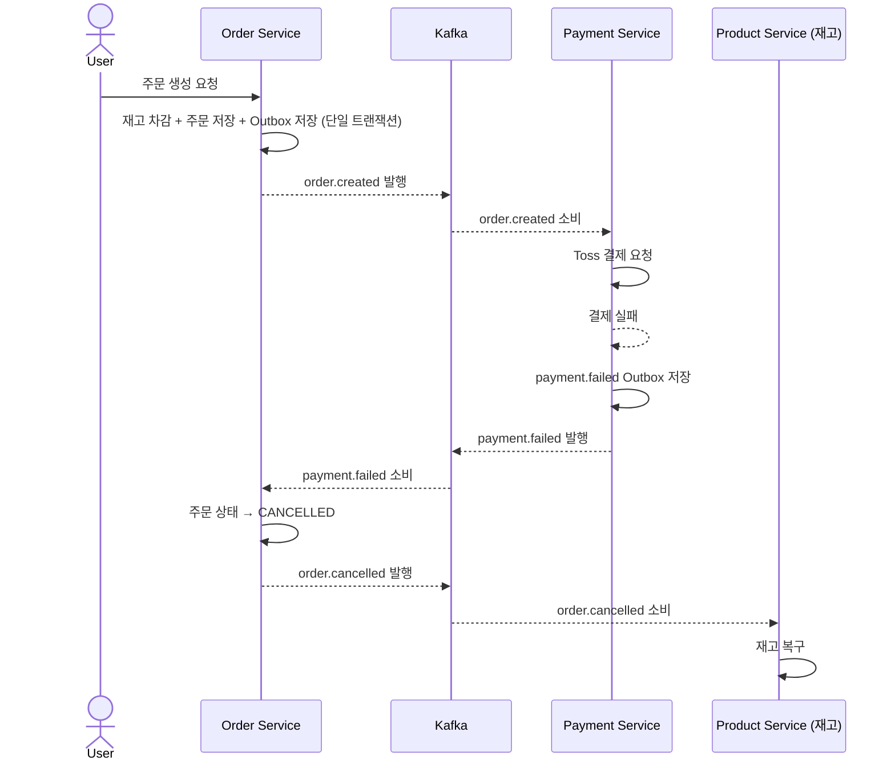

## 8. Kafka 이벤트 설계

### 8-1. 이벤트 토픽 설계

| 토픽명 | Producer | Consumer | 설명 |
| --- | --- | --- | --- |
| `order.created` | Order Service | Payment Service, Notification Service | 주문 생성 이벤트 |
| `payment.completed` | Payment Service | Order Service, Notification Service | 결제 성공 이벤트 |
| `payment.failed` | Payment Service | Order Service, Notification Service | 결제 실패 → Saga 보상 트랜잭션 + 알림 |
| `order.cancelled` | Order Service | Product Service, Notification Service | 주문 취소 → 재고 복구 |

> 모든 이벤트는 **Outbox 패턴**을 통해 발행됩니다.
Producer는 DB 트랜잭션 내에서 Outbox 테이블에 이벤트를 저장하고, 별도 Polling 스케줄러가 Kafka로 발행합니다.
>

### 8-2. 이벤트 페이로드 스키마

### order.created

```json
{
  "eventId": "550e8400-e29b-41d4-a716-446655440000",
  "eventType": "order.created",
  "timestamp": "2026-03-20T10:30:00Z",
  "payload": {
    "orderId": 1001,
    "orderNumber": "ORD-20260320-0001",
    "userId": 42,
    "totalAmount": 59000,
    "items": [
      {
        "productId": 10,
        "quantity": 2,
        "unitPrice": 29500
      }
    ],
    "receiverName": "홍길동",
    "address": "서울시 강남구 ..."
  }
}
```

### payment.completed

```json
{
  "eventId": "661f9511-f30c-52e5-b827-557766551111",
  "eventType": "payment.completed",
  "timestamp": "2026-03-20T10:31:00Z",
  "payload": {
    "paymentId": 501,
    "orderId": 1001,
    "userId": 42,
    "paymentKey": "toss_pay_key_abc123",
    "amount": 59000,
    "method": "CARD",
    "approvedAt": "2026-03-20T10:31:00Z"
  }
}
```

### 8-3. DLQ(Dead Letter Queue) 전략

```
Consumer 재시도 흐름:
  1. 메시지 처리 실패 시 최대 3회 재시도 (fixed sequence backoff: 1s, 5s, 30s)
  2. 3회 초과 실패 → {원본 토픽}.dlq 토픽으로 이동
     예: order.created 실패 → order.created.dlq
  3. DLQ 메시지 모니터링 → Slack 알림 발송
  4. 수동 재처리: DLQ 메시지를 확인 후 원인 해결 → 원본 토픽으로 재발행

DLQ 토픽:
  - order.created.dlq
  - payment.completed.dlq
  - payment.failed.dlq
  - order.cancelled.dlq
```

### 8-4. Consumer Group 네이밍 규칙

```
규칙: {service-name}-{topic-name}-group

예시:
  - payment-svc-order-created-group     (Payment Service가 order.created 소비)
  - notification-svc-order-created-group (Notification Service가 order.created 소비)
  - order-svc-payment-completed-group   (Order Service가 payment.completed 소비)
  - product-svc-order-cancelled-group   (Product Service가 order.cancelled 소비)

같은 토픽을 여러 서비스가 소비할 때, 각 서비스는 독립 Consumer Group을 운영하여
서비스별 독립적 오프셋 관리와 소비 속도 조절이 가능합니다.
```

### 8-5. Choreography Saga 플로우 (Phase 4 — 결제 실패 시)



---

## 9. 주요 설계 결정

### 9-1. 재고 동시성 제어 — Redis 분산 락 + DB 낙관적 락

두 전략을 함께 쓰는 이유는 **장애 시나리오 대응** 때문입니다.

```
정상 상황: Redis 분산 락으로 동시 요청 직렬화
           락 획득 실패 → 즉시 409 응답 (재고 부족 처리)

Redis 장애: 분산 락 획득 불가 → DB 낙관적 락(version)이 최후 방어선
            → 충돌 시 OptimisticLockException → 재고 부족 응답
```

Redis 락이 있으면 낙관적 락 충돌은 거의 발생하지 않지만, Redis 장애·만료 상황에서 오버셀링을 막기 위한 이중 방어입니다.

**핵심 제약: 락 범위 ⊃ 트랜잭션 범위**

분산 락은 반드시 트랜잭션 커밋 이후에 해제해야 합니다. 락을 먼저 해제하면 커밋 전 데이터를 다른 스레드가 읽어 오버셀링이 발생합니다.

```
올바른 순서: 락 획득 → 트랜잭션 시작 → 재고 변경 → 트랜잭션 커밋 → 락 해제
잘못된 순서: 트랜잭션 시작 → 락 획득 → 재고 변경 → 락 해제 → 트랜잭션 커밋 ✗
```

이를 보장하기 위해 락 관리(Facade)와 트랜잭션 로직(Service)을 분리합니다.

### 9-2. JWT Refresh Token — DB 저장 + Redis 블랙리스트

```
refresh_tokens 테이블 (DB):  토큰 발급 이력, 만료일 관리, 영속성 보장
Redis (블랙리스트):           로그아웃된 토큰 즉시 무효화 (TTL = 남은 만료 시간)
```

DB 단독 사용 시 매 요청마다 DB 조회가 발생하고, Redis 단독 사용 시 서버 재시작에서 데이터가 유실될 수 있습니다. 두 저장소의 역할을 분리해 각 단점을 보완합니다.

> **Phase 4**: rotation 을 삭제 기반에서 **이력 모델**(`family_id`/`status`/`grace_until`)로 전환하여 **Refresh Token Reuse Detection**(탈취 감지 시 family 전체 무효화 + Gateway access token 차단)을 도입한다 (see ADR-0013 §D4).

### 9-3. Outbox 패턴 — Kafka 이벤트 유실 방지 (Phase 2~)

```
기존 방식 (문제):
  DB 저장 성공 → Kafka 발행 실패 → 이벤트 유실, 데이터 불일치

Outbox 패턴 (해결):
  DB 저장 + Outbox 테이블 저장 (단일 트랜잭션)
  → Polling 스케줄러가 Outbox를 읽어 Kafka 발행
  → 발행 성공 시 Outbox 레코드 PUBLISHED 상태 업데이트
  → 실패 시 retry_count 증가, 횟수 초과 시 FAILED 처리 + Slack 알림

DLQ 연계:
  Outbox 발행 자체의 FAILED와 Consumer 처리 실패의 DLQ는 별개 메커니즘입니다.
  - Outbox FAILED: Producer 측 발행 실패 (네트워크, Kafka 브로커 장애)
  - DLQ: Consumer 측 처리 실패 (비즈니스 로직 에러, 데이터 정합성 문제)
  두 경로 모두 Slack 알림으로 운영자에게 통지합니다.
```

Phase 1에서는 `@TransactionalEventListener`만 사용하며 Kafka는 없습니다.
**Phase 2**부터 Kafka + Outbox 패턴을 도입하고 `outbox_events` 테이블을 추가합니다.

### 9-4. Saga 패턴 — Phase별 구현 방식

Phase 1과 Phase 4의 구현 방식은 다릅니다.

```
Phase 1 (모놀리식):
  @TransactionalEventListener(phase = AFTER_COMMIT)
  → 결제 실패 이벤트 수신 후 로컬 보상 트랜잭션 실행
  → 분산 환경이 아니므로 Saga라고 부르기보다 보상 트랜잭션에 가까움

Phase 4 (MSA):
  Choreography-based Saga
  → order.created → Product 재고 예약 → stock.reservation.result → 결제 시작(reserved=true)
  → payment.failed 이벤트 → Order Service 소비 → 주문 취소
  → order.cancelled 이벤트 → Product Service 소비 → 재고(예약) 복구
  → 각 서비스가 이벤트에 반응해 자율적으로 보상 처리 (see ADR-0012 §D3/§D4 토폴로지 매트릭스)
```

### 9-5. 알림 발송 채널 — Slack Webhook

Notification Service는 이벤트를 수신한 후 Slack Webhook으로 실제 알림을 발송합니다. 추가 인프라 없이 실제 동작을 증명할 수 있으며, 테스트 환경에서 알림 수신을 즉시 확인할 수 있습니다.

### 9-6. 재고 차감 시점 — 주문 생성 시 즉시 차감 (전략 A)

재고 차감을 언제 수행하는지는 비즈니스 정합성과 구현 복잡도에 직접 영향을 미치는 핵심 설계 결정입니다.

```
전략 A (채택): 주문 생성 시 즉시 차감
  주문 생성 트랜잭션 내에서 재고 차감 + 주문 저장을 단일 트랜잭션으로 처리
  (Phase 2부터는 + Outbox 저장 포함)
  결제 실패 시 order.cancelled 이벤트 → 재고 복구 (Saga 보상 트랜잭션)
  장점: 이중 주문 방지, 구현 단순
  단점: 결제 실패 → 복구 완료 사이 재고가 일시적으로 묶임

전략 B (미채택): 결제 완료 후 확정 차감
  주문 생성 시 재고 예약(soft lock) → 결제 완료 시 확정 차감
  장점: 재고 묶임 최소화
  단점: 예약 상태 관리, 예약 만료 처리 등 구현 복잡도 증가
```

> **Phase 4 (MSA) 전환 시**: Product Service 가 재고 소유자가 되어 Order 가 단일 트랜잭션으로 직접 차감할 수 없으므로, 전략 A 대신 **Product 예약 모델(전략 B 계열)** 로 전환한다 — `order.created → Product 예약 → stock.reservation.result → 결제`, 실패/취소 시 예약 해제·복구 (see ADR-0012 §D3). 모놀리스(Phase 1~3) 단계에서는 전략 A 유지.

포트폴리오 범위에서는 전략 A를 채택합니다. 재고 묶임 시간을 최소화하기 위해 결제 타임아웃(Toss Payments 기준 15분)을 명시합니다.

**Phase 1 결제 타임아웃 대응**:
Phase 1에서는 단일 인스턴스이므로 `@Scheduled` 기반의 간단한 타임아웃 취소 스케줄러를 구현합니다 (ShedLock 불필요). 주기적으로 `PAYMENT_REQUESTED` 상태가 15분을 초과한 주문을 조회하여 자동 취소 + 재고 복구를 수행합니다. Phase 2에서 ShedLock을 추가하여 분산 환경 대비를 완료합니다.

### 9-7. Kafka Consumer 멱등성 처리

at-least-once 보장으로 인해 동일 이벤트가 중복 소비될 수 있습니다. 중복 처리 시 재고 이중 차감, 결제 이중 처리 등 치명적인 문제가 발생할 수 있어 멱등성 처리가 필수입니다.

```
처리 전략: processed_events 테이블 — save-first + UK 선점 패턴

Consumer 수신 시:
  1. (event_id, consumer_group)을 processed_events 테이블에서 조회 (빠른 경로)
  2. 이미 존재하면 → 중복 메시지로 판단, 처리 건너뜀
  3. 존재하지 않으면 → processed_events에 처리 이력 선점 기록 (INSERT)
     - UK 충돌(DataIntegrityViolationException) 발생 시 → 동시 중복으로 판단, 처리 건너뜀
  4. 비즈니스 로직 실행 (호출자 @Transactional 컨텍스트에 참여)
     - 실패 시 트랜잭션 롤백 → 처리 이력도 함께 삭제되어 재처리 가능
```

`event_id`는 Outbox 이벤트 생성 시 UUID로 부여합니다.

> 운영 환경에서는 `processed_at` 기준 30일 이상 경과 데이터를 배치 삭제하거나 파티셔닝을 적용합니다.

### 9-8. 주문 상태 전이도

`orders.status`는 주문 생명주기 전체를 표현합니다. 배송 상태는 포트폴리오 범위에서 `SHIPPED`, `DELIVERED`까지 포함합니다.

```
PENDING → PAYMENT_REQUESTED → PAYMENT_COMPLETED → PREPARING → SHIPPED → DELIVERED
                ↓
          PAYMENT_FAILED → CANCELLED
                                ↑
               (결제 타임아웃 15분 초과 시 스케줄러가 자동 전이)
```

| 상태 | 설명 |
| --- | --- |
| `PENDING` | 주문 생성, 재고 차감 완료 |
| `PAYMENT_REQUESTED` | Toss 결제 위젯 오픈 |
| `PAYMENT_COMPLETED` | 결제 승인 완료 |
| `PAYMENT_FAILED` | 결제 실패 → 재고 복구 트리거 |
| `PREPARING` | 상품 준비 중 |
| `SHIPPED` | 배송 시작 |
| `DELIVERED` | 배송 완료 |
| `CANCELLED` | 취소 (결제 실패 / 타임아웃 / 수동 취소) |

### 9-9. Kafka 파티션 키 전략

동일 주문에 대한 이벤트(`order.created` → `payment.completed` → `order.cancelled`)가 순서대로 처리되려면 파티션 키를 `order_id`로 설정해야 합니다.

```
파티션 키: order_id
  → 동일 order_id의 이벤트는 항상 같은 파티션으로 라우팅
  → 파티션 내 순서 보장

초기 파티션 설정:
  토픽: order.created, payment.completed, payment.failed, order.cancelled
  파티션 수: 3 (Consumer 수와 동일, 1:1 매핑)
  Replication Factor: 1 (로컬 단일 브로커 기준)
  Consumer Group: 서비스별 독립 Consumer Group 운영 (네이밍 규칙: 섹션 8-4)
```

### 9-10. ShedLock — 스케줄러 중복 실행 방지

결제 타임아웃 자동 취소 스케줄러와 Outbox 폴링 스케줄러는 Phase 3~4에서 수평 확장(HPA)되면 여러 Pod에서 동시에 실행될 수 있습니다. ShedLock으로 분산 환경에서 스케줄러가 단일 인스턴스에서만 실행되도록 보장합니다.

```java
// 결제 타임아웃 자동 취소 — 60초 주기, 락 최대 10분 / 최소 30초
@SchedulerLock(name = "orderTimeoutCancelJob", lockAtMostFor = "PT10M", lockAtLeastFor = "PT30S")
@Scheduled(fixedDelay = 60000)
public void cancelExpiredOrders() { ... }

// Outbox 폴링 → Kafka 발행 — 5초 주기, 락 최대 5분 / 최소 4초
@SchedulerLock(name = "outboxPollingJob", lockAtMostFor = "PT5M", lockAtLeastFor = "PT4S")
@Scheduled(fixedDelay = 5000)
public void pollAndPublish() { ... }
```

ShedLock은 DB(MySQL)에 `shedlock` 테이블을 생성해 락을 관리합니다.

> **Phase 2 배치 근거**: Phase 2에서는 단일 인스턴스이므로 ShedLock의 분산 락 기능이 즉시 필요하지 않습니다. 그러나 스케줄러 구현 시점(Phase 2)에 ShedLock을 함께 적용하여 Phase 3~4 분산 환경 전환 시 추가 작업 비용을 제거합니다.
>

### 9-11. Refresh Token Rotation — Race Condition 처리

동시에 두 요청이 같은 Refresh Token으로 재발급을 요청하면, 두 번째 요청은 이미 무효화된 토큰을 사용해 사용자가 의도치 않게 로그아웃 처리될 수 있습니다.

```
완화 전략: Grace Period 적용
  Refresh Token 재발급 시 이전 토큰을 즉시 삭제하지 않고
  짧은 유효 기간(예: 10초)을 두고 유예 후 만료 처리
  → 정상적인 동시 요청(탭 여러 개, 네트워크 재시도)은 허용
  → 탈취된 토큰 재사용은 유예 시간 초과 후 차단

구현:
  Redis에 이전 토큰을 TTL=10s로 보관 (블랙리스트와 별도 키 공간)
  → 유예 기간 내 요청은 허용, 만료 후 완전 차단
```

### 9-12. 에러 핸들링 체계

### 표준 에러 응답 포맷

```json
{
  "status": 400,
  "code": "ORD-001",
  "message": "재고가 부족합니다.",
  "timestamp": "2026-03-20T10:30:00Z"
}
```

### 도메인별 에러 코드 체계

| 접두사 | 도메인 | 예시 |
| --- | --- | --- |
| `USR` | User | USR-001: 이메일 중복, USR-002: 인증 실패 |
| `PRD` | Product | PRD-001: 상품 미존재, PRD-002: 재고 부족 |
| `ORD` | Order | ORD-001: 주문 미존재, ORD-002: 이미 취소된 주문 |
| `PAY` | Payment | PAY-001: 결제 금액 불일치, PAY-002: 결제 타임아웃 |
| `SYS` | System | SYS-001: 내부 서버 오류, SYS-002: 외부 API 호출 실패 |

### 예외 계층 구조

```
BusinessException (추상)        — 도메인별 에러 코드 + HTTP 상태 코드 포함
  ├── UserException             — USR-XXX
  ├── ProductException          — PRD-XXX
  ├── OrderException            — ORD-XXX
  └── PaymentException          — PAY-XXX

SystemException                 — SYS-XXX, 500 응답 고정
```

`GlobalExceptionHandler`에서 `BusinessException`은 에러 코드와 메시지를 그대로 반환하고, 그 외 예외는 `SYS-001`로 래핑하여 내부 정보 노출을 방지합니다.

### 9-13. MSA 동기 호출 시나리오 대응 — CQRS 로컬 캐시

Phase 4 MSA 환경에서 주문 생성 시 상품 가격/재고를 실시간으로 확인해야 합니다. 순수 비동기(Kafka)만으로는 최신 데이터를 즉시 얻을 수 없고, 동기 API 호출은 서비스 간 결합도를 높입니다.

```
대안 비교:
  1. 동기 API 호출 (REST)     → 서비스 간 직접 의존, 장애 전파 위험
  2. CQRS 로컬 캐시 (채택)    → Product 변경 이벤트 구독 → Order Service 내 로컬 캐시에 상품 정보 유지
  3. API Gateway 집계          → Gateway에 비즈니스 로직 혼입, 책임 분리 위반

채택한 CQRS 로컬 캐시 방식:
  Product Service → product.updated 이벤트 발행 (Outbox 경유)
  Order Service → product.updated 소비 → 로컬 product_cache 테이블 갱신
  주문 생성 시 → product_cache에서 가격/재고 정보 조회 (동기 호출 불필요)

장점: 기존 이벤트 드리븐 아키텍처와 일관, 서비스 간 직접 호출 없음
단점: 이벤트 전파 지연 동안 캐시와 원본 간 일시적 불일치 가능
  → 주문 확정 시점에 Saga 보상 트랜잭션으로 정합성 보장
```

> `product.updated` payload 필수 필드(productId/name/price/availableStock/status/categoryId/updatedAt) 및 파티션 키(productId)는 ADR-0012 §D2 에서 확정 (see ADR-0012).

---

## 10. 알려진 한계 및 트레이드오프

설계 과정에서 인지한 한계와 트레이드오프를 명시합니다. "몰랐던 게 아니라 알고 선택했다"는 근거를 남기는 것이 목적입니다.

### 10-1. Outbox Polling 방식의 이벤트 지연

Polling 스케줄러 방식은 폴링 주기(예: 1~5초)만큼 이벤트 발행이 지연됩니다.

```
대안: Debezium CDC (Change Data Capture)
  MySQL binlog를 실시간으로 읽어 Kafka에 발행 → 지연 최소화
  단점: Kafka Connect 클러스터 추가 인프라 필요, 운영 복잡도 증가

Polling 방식 선택 이유:
  - 포트폴리오 범위에서 수십~수백ms 지연은 허용 가능
  - 추가 인프라 없이 Spring Scheduler로 구현 가능
  - 운영 복잡도 vs 정확성 트레이드오프를 인지한 상태로 선택
  - 추후 트래픽 증가 시 Debezium 전환 가능한 구조로 설계
```

### 10-2. API Gateway 인증 책임 범위 (RS256·Rate Limit·헤더 신뢰 모델은 see ADR-0013)

Phase 4에서 JWT 검증은 Spring Cloud Gateway에서 **RS256 공개키**로 수행하며(서명은 User 서버 개인키), 내부 서비스는 별도 JWT 재검증을 수행하지 않습니다. Gateway 검증 순서(서명/만료 → blacklist+family deny → 헤더 주입)·헤더 위조 차단·Rate Limit 은 ADR-0013 §D1/D3.

```
Gateway 통과 후 내부 서비스 호출 시:
  - Gateway가 검증된 사용자 정보(user_id, role)를 HTTP 헤더로 전달
  - 내부 서비스는 헤더 값을 신뢰하고 비즈니스 로직 처리

보안 전제:
  - 내부 서비스는 Gateway를 통해서만 접근 가능
  - K8s NetworkPolicy로 서비스 간 직접 통신 차단 (외부 → Gateway → 서비스만 허용)
  - 내부 재검증 생략으로 성능 향상, NetworkPolicy로 신뢰 경계 보장
```

### 10-3. 페이지네이션 전략 — Offset 방식의 한계

현재 주문 내역 조회는 Offset 기반 페이지네이션으로 구현합니다.

```
Offset 방식의 문제:
  - 대용량 데이터에서 OFFSET N이 클수록 풀 스캔에 가까워져 성능 저하
  - 예: LIMIT 20 OFFSET 10000 → 10020개 행을 읽고 앞 10000개 버림

개선 방향 (Phase 4에서 전환 검토):
  - Cursor 기반 페이지네이션으로 전환
  - 마지막으로 조회한 order_id를 커서로 사용 → WHERE id < :cursor LIMIT 20
  - 인덱스 범위 스캔만 수행해 일정한 응답시간 보장
```

### 10-4. Choreography Saga — DLQ 이후 재고 불일치 감지

Outbox 패턴으로 이벤트 발행 실패는 방지할 수 있지만, Consumer 측 처리 실패(DLQ 도달)는 결국 수동 개입이 필요합니다.

```
시나리오:
  order.cancelled 이벤트 → Product Service Consumer 3회 재시도 실패 → DLQ 이동
  → 재고가 복구되지 않은 상태로 지속

현재 대응:
  - DLQ 도달 시 Slack 알림 발송 (섹션 8-3)
  - 운영자가 알림 수신 → 원인 해결 → 원본 토픽으로 수동 재발행

한계:
  - 수동 재처리 전까지 재고 수치와 주문 상태 간 불일치가 존재함
  - 감지 보완책: orders.status = CANCELLED 이면서 inventory.stock이
    예상값보다 낮은 경우를 탐지하는 정합성 검사 쿼리를 주기적으로 실행

선택 근거:
  - Orchestration Saga(중앙 조율자)로 전환하면 불일치 감지가 용이하나
    구현 복잡도가 크게 증가함
  - 포트폴리오 범위에서 DLQ 알림 + 수동 재처리는 허용 가능한 트레이드오프
```

### 10-5. @TransactionalEventListener — AFTER_COMMIT 이후 실패 처리

Phase 1에서 `@TransactionalEventListener(phase = AFTER_COMMIT)`를 사용할 때, 핸들러 내부에서 예외가 발생해도 주문 트랜잭션은 이미 커밋된 상태입니다.

```java
@TransactionalEventListener(phase = TransactionPhase.AFTER_COMMIT)
public void handleOrderCreated(OrderCreatedEvent event) {
    // 여기서 예외 발생 → 주문은 커밋되어 있으나 결제/알림 처리 누락
    // 롤백 불가능
}
```

```
Phase 1 대응:
  - try-catch로 감싸고 실패 로깅 처리
  - 결제/알림 이벤트 처리 실패는 수동 확인 대상

한계이자 Phase 2 전환 근거:
  - 이 문제가 Phase 2에서 Outbox 패턴으로 전환하는 직접적인 이유임
  - Outbox 패턴에서는 이벤트 저장이 주문 트랜잭션 안에서 이루어지므로
    발행 실패 시 retry_count 증가 → 자동 재시도로 해결됨

면접 대응:
  "Phase 1에서 결제 이벤트 처리가 실패하면 어떻게 되나요?"
  → "AFTER_COMMIT 이후이므로 주문 롤백은 불가하며, 로그 기록 후 수동 재처리합니다.
     이 한계가 Phase 2 Outbox 전환의 핵심 근거입니다."
```

### 10-6. Redis 단일 인스턴스 — JWT 블랙리스트 SPOF

분산 락 Redis 장애 시 DB 낙관적 락 fallback이 설계되어 있지만(섹션 9-1), JWT 블랙리스트에 대한 Redis 장애 시나리오는 별도 처리가 없습니다.

```
Redis 장애 시:
  - 분산 락: DB 낙관적 락(version)이 최후 방어선 → 이미 설계됨
  - JWT 블랙리스트: 로그아웃된 토큰이 일시적으로 유효하게 처리될 수 있음

선택 근거:
  - 현 운영 환경(단일 K8s 클러스터 내 Redis 단일 인스턴스)에서 Sentinel/Cluster는
    운영 복잡도 대비 효용 낮음
  - Access Token 만료 시간(예: 30분)이 짧아 장애 지속 시간이 길지 않다면
    실제 보안 위협은 제한적임
  - 포트폴리오 범위에서 허용 가능한 트레이드오프로 판단
  - 프로덕션 전환 시 Redis Sentinel 구성 필요
```

### 10-7. 성능 측정 환경과 수치 맥락

성능 수치는 측정 환경의 특성과 함께 해석되어야 합니다. PeekCart 는 Phase 진행에 따라 측정 환경이 진화하므로, 환경별 측정 방침을 구분하여 기술합니다.

> 환경 SSOT: `docs/01-project-overview.md` §4. 환경 선택 근거: ADR-0004 (§Context 가 Phase 3 초기 minikube 선택 근거를 포함. ADR-0003 은 Deprecated).

#### 측정 방침의 공통 원칙

- 절대값보다 **개선 비율**(캐싱 전/후 TPS 비교, HPA 적용 전/후 처리량 변화)에 초점을 맞춘다.
- 측정 시 환경·시나리오·도구 버전을 함께 기록하여 재현 가능성을 확보한다.
- 환경이 바뀌면 이전 수치와 동일 축에서 비교하지 않고 환경별 baseline 을 재수집한다.

#### Phase 1·2 — 기능 검증 단계 (로컬 Docker Compose)

- **목적**: 기능 동작 검증 및 통합 테스트. 정식 부하 측정은 수행하지 않음
- **환경**: 로컬 Docker Compose (MySQL / Redis / Kafka 컨테이너) + 앱 로컬 실행
- **수치 기록**: 단위/통합 테스트 통과 여부 중심. TPS·p99 등의 성능 수치는 Phase 3 에서 수집
- **선택 근거**: 기본 로컬 개발 환경 (별도 ADR 없음)

#### Phase 3 초기 (Task 3-1 ~ 3-3) — K8s 도입 (로컬 minikube)

- **목적**: CI, K8s 매니페스트 작성, kube-prometheus-stack 구축의 반복 사이클 확보
- **환경**: 로컬 minikube, CPU 4 / Memory 8GB (macOS)
- **수치 기록**: 기능 검증 중심. 본격적인 부하 측정은 Task 3-4 에서 GKE 로 수행
- **선택 근거**: ADR-0004 §Context (Phase 3 Task 3-1~3-3 minikube 선택 근거 포함. 구 ADR-0003 은 Deprecated 처리되어 내용이 ADR-0004 로 흡수됨)

#### Phase 3 — 부하 테스트 단계 (GCP / GKE)

- **목적**: 상품 조회 TPS(캐싱 전/후), 동시 주문 정합성(1,000 VUser), HPA 스케일아웃, Kafka Consumer Lag 의 실측
- **환경**: GCP GKE Standard (asia-northeast3-a), 노드 e2-standard-4 × 1 (일반), 부하 발생기는 같은 zone 의 별도 Compute Engine VM
- **수치 기록 방침**: 각 시나리오마다 (a) 환경 스펙 (b) 도구 버전·설정 (c) 시나리오 파라미터 (d) baseline 수치 (e) 개선 후 수치 (f) 개선 비율을 함께 기록
- **선택 근거**: ADR-0004 (minikube 의 메모리/네트워크 한계가 측정 정확도를 제약하는 점이 직접 원인)

> Phase 1·2 측정값과 Phase 3 측정값은 환경이 다르므로 동일 축 비교 대상이 아닙니다. Phase 3 의 캐싱 전/후·HPA 전/후 비교는 모두 **동일 GKE 환경 내에서** 수행합니다.
