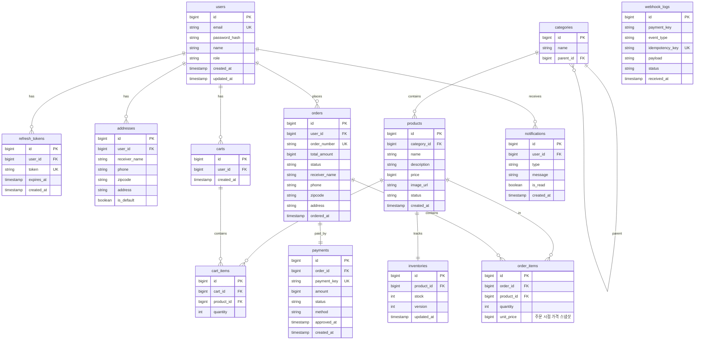
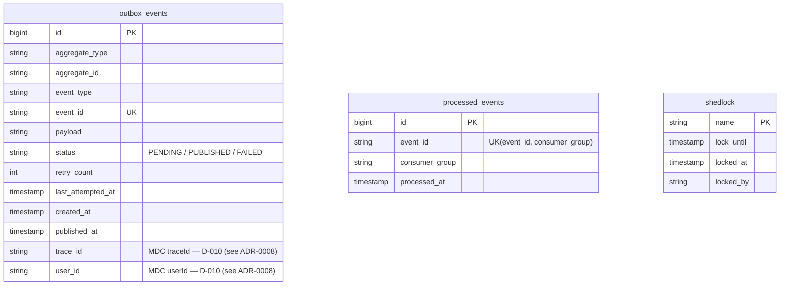
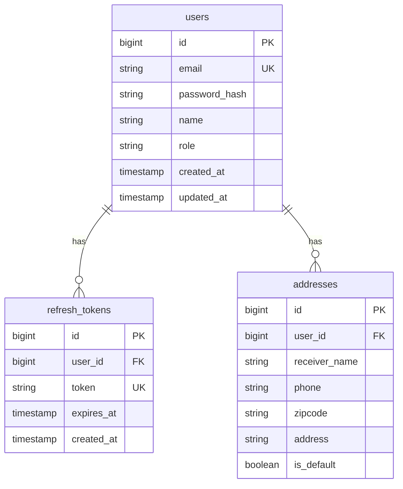
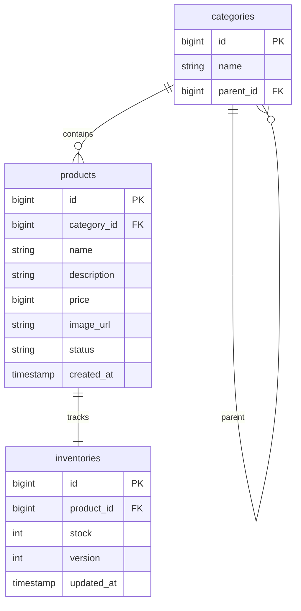
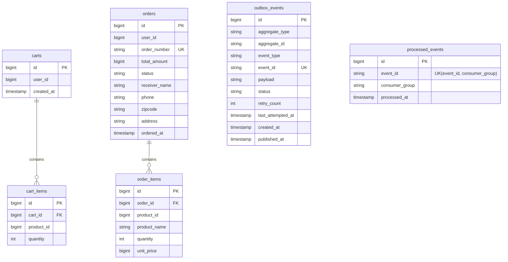
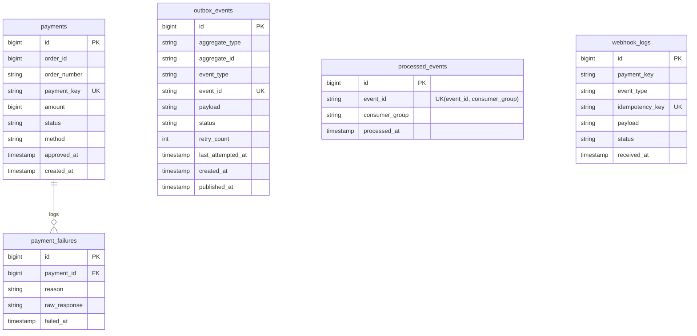
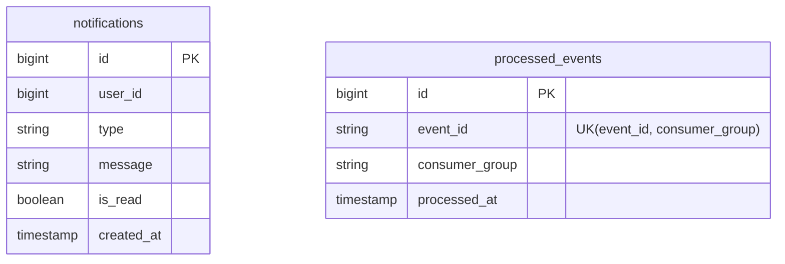

## 11. ERD 설계

### Phase 1 — 단일 DB (모놀리식)

> 모든 도메인 테이블이 하나의 MySQL DB에 통합됩니다.
Phase 1에서는 `@TransactionalEventListener`를 사용하므로 Outbox/processed_events 테이블이 없습니다.
>

> **`order_items.unit_price` 설계 의도**: Phase 1에서도 단일 DB FK로 `products` 테이블을 조인할 수 있지만, 상품 가격이 변경되어도 주문 당시 가격을 보존하기 위해 주문 시점의 가격을 스냅샷으로 저장합니다.
**`payment_failures` 미포함 근거**: Phase 1에서는 `payments.status = 'FAILED'`로 결제 실패를 충분히 표현할 수 있으므로 별도 테이블 없이 운영합니다. 상세 실패 사유 로깅은 Phase 4에서 `payment_failures` 테이블을 도입하여 대응합니다.
>

### Phase 2 — ERD 변경점 (Delta)

Phase 2에서 Kafka + Outbox 패턴 도입에 따라 아래 테이블이 추가됩니다.

> Phase 1 → Phase 2 스키마 마이그레이션은 Flyway로 관리합니다.
`outbox_events`, `processed_events`, `shedlock` 테이블이 Phase 2에서 추가되는 스키마 변경입니다.
>

### Phase 4 — 서비스별 DB 분리 (MSA)

> DB 간 FK 제약 없음 — 필요한 데이터는 이벤트 수신 시점에 스냅샷으로 저장합니다.
각 서비스 DB에 `outbox_events` 테이블이 포함됩니다.
>

### User DB

> Redis는 로그아웃된 Refresh Token의 블랙리스트 저장소로 별도 운영합니다.
>

### Product DB

> Product 가 Phase 4 에서 `product.updated`/`stock.reservation.result` 발행 + `order.created`/`payment.*` 소비를 하므로 `outbox_events`/`processed_events` 를 소유하고, `inventories` 에 예약 컬럼(available/reserved)을 도입한다 (see ADR-0012 §D1/§D3). DDL 은 구현 ②.

### Order DB

> `order_items`의 `product_name`, `unit_price`는 주문 시점 스냅샷으로 저장 (상품 가격 변경 대응)
`cart_items`는 최신 상품 정보를 반영해야 하므로 스냅샷 컬럼을 포함하지 않습니다. 장바구니 조회 시에는 CQRS 로컬 캐시(섹션 9-13)에서 최신 상품 정보를 조합합니다.
>

### Payment DB

### Notification DB

> Notification Service 가 DB 를 소유함을 ADR-0010 §D1 (F1) 에서 확정 — `02-architecture.md §5` DataLayer 와 정합 (see ADR-0010).

### 인덱스 전략

| 테이블 | 인덱스 | 용도 |
| --- | --- | --- |
| `orders` | `idx_orders_user_id_status (user_id, status)` | 사용자별 주문 내역 조회 (상태 필터) |
| `orders` | `idx_orders_status_ordered_at (status, ordered_at)` | 타임아웃 스케줄러 조회 (PAYMENT_REQUESTED + 시간 조건) |
| `order_items` | `idx_order_items_order_id (order_id)` | 주문별 상품 목록 조회 |
| `products` | `idx_products_category_status (category_id, status)` | 카테고리별 상품 목록 조회 |
| `outbox_events` | `idx_outbox_status_created (status, created_at)` | Polling 스케줄러 대상 조회 (PENDING 상태) |
| `outbox_events` | `trace_id` / `user_id` 컬럼은 인덱스 없음 | trace 기반 조회는 사후 ad-hoc 분석용 — 인덱스 추가 시 insert/update 비용만 증가 (see ADR-0008) |
| `processed_events` | `uk_processed_event_consumer (event_id, consumer_group)` | 멱등성 체크 (중복 소비 방지, 복합 UK) |
| `notifications` | `idx_notifications_user_id (user_id)` | 사용자별 알림 목록 조회 |
| `refresh_tokens` | `idx_refresh_tokens_user_id (user_id)` | 사용자별 토큰 조회/삭제 |

### ERD Phase 1 vs Phase 4 비교

| 항목 | Phase 1 | Phase 4 |
| --- | --- | --- |
| DB 수 | 1개 (통합) | 5개 (서비스별 분리) |
| FK 제약 | DB 레벨 FK 사용 | FK 제약 없음 (이벤트 참조) |
| 상품 정보 저장 | `product_id` FK로 조인 | 주문 시점 스냅샷 저장 |
| 결제-주문 연결 | `order_id` FK | `order_number` 이벤트 참조 |
| 데이터 정합성 | DB 트랜잭션 보장 | Saga 패턴으로 보장 |
| 이벤트 유실 방지 | 해당 없음 (로컬 이벤트) | 서비스별 DB Outbox 테이블 |
| 멱등성 처리 | 해당 없음 (로컬 이벤트) | 서비스별 DB processed_events 테이블 |
| 웹훅 중복 처리 | webhook_logs 테이블 | Payment DB webhook_logs 테이블 |
