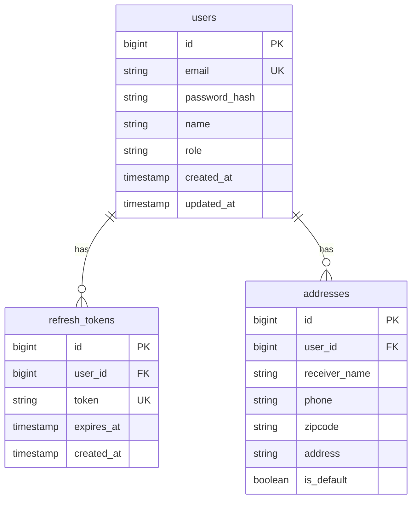
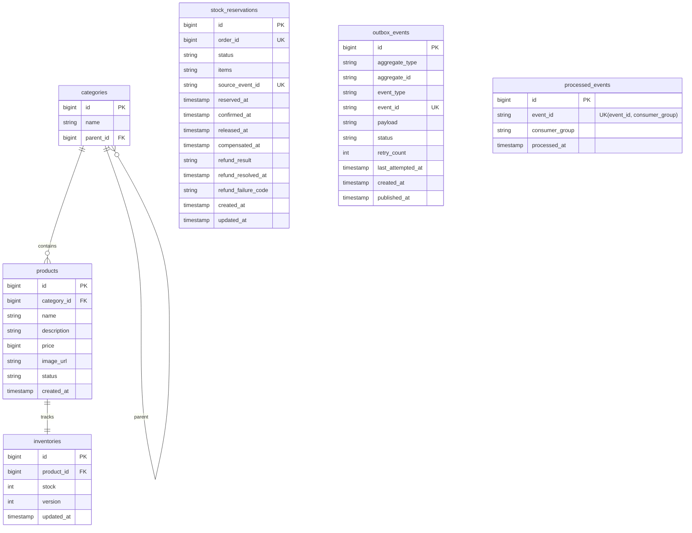
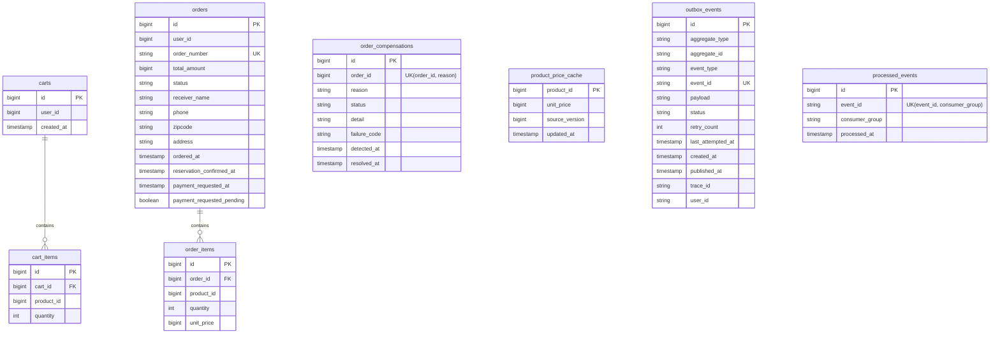
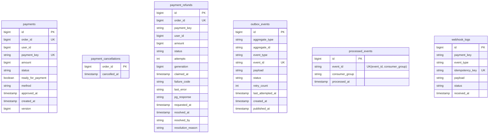
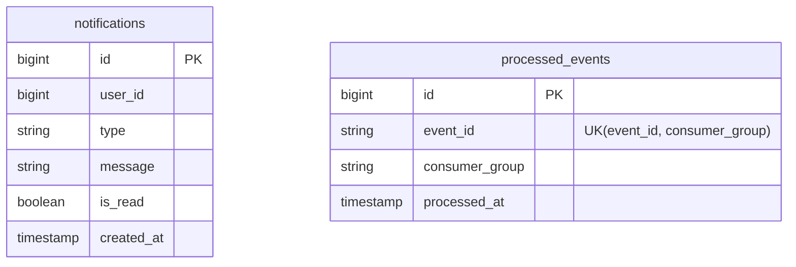

## 11. ERD 설계

> Phase 1 단일 DB ERD, Phase 2 변경점, Phase 1 대비 비교표는 `docs/progress/design-archive-phase1-2.md` 로 옮겼다.

### Phase 4 — 서비스별 DB 분리 (MSA)

> DB 간 FK 제약 없음 — 필요한 데이터는 이벤트 수신 시점에 스냅샷으로 저장합니다.
발행/소비 서비스 DB에 `outbox_events`/`processed_events` 테이블이 포함됩니다(소비 전용 notification 은 `processed_events` 만).
>
> **물리 구성 (구현 ② PR2, see ADR-0012 §D1·ADR-0016)**: 5개 서비스가 각자 독립 스키마(`peekcart_user`/`peekcart_product`/`peekcart_order`/`peekcart_payment`/`peekcart_notification`) + 독립 계정·권한(자기 스키마에만 GRANT) + 독립 Flyway 이력(`V1__init_<svc>.sql`)을 소유합니다. 현재는 **1 MySQL 인스턴스 + 5 스키마**(논리 분리)이며, 인스턴스 물리 분리는 datasource URL 교체만으로 가역 승격 가능합니다. 교차 도메인 FK 6개는 PR1(V13)에서 제거하고 ID 참조로 대체했습니다.

### User DB

```mermaid
erDiagram
  users {
    bigint id PK
    string email UK
    string password_hash
    string name
    string role
    timestamp created_at
    timestamp updated_at
  }
  refresh_tokens {
    bigint id PK
    bigint user_id FK
    string token UK
    timestamp expires_at
    timestamp created_at
  }
  addresses {
    bigint id PK
    bigint user_id FK
    string receiver_name
    string phone
    string zipcode
    string address
    boolean is_default
  }
  users ||--o{ refresh_tokens : has
  users ||--o{ addresses : has
```

> Phase 4: `refresh_tokens` 에 `family_id`/`status`(ACTIVE/ROTATED/REVOKED)/`grace_until`/`rotated_at` 를 추가해 삭제 기반 rotation 을 이력 모델로 전환, Reuse Detection 을 지원한다 (see ADR-0013 §D4). DDL 은 구현 ③.

> Redis는 로그아웃된 Refresh Token의 블랙리스트 저장소로 별도 운영합니다 (+ Phase 4: family/session deny enforcement — 탈취 감지 시 이미 발급된 access token 즉시 차단, see ADR-0013).
>

### Product DB

```mermaid
erDiagram
  categories {
    bigint id PK
    string name
    bigint parent_id FK
  }
  products {
    bigint id PK
    bigint category_id FK
    string name
    string description
    bigint price
    string image_url
    string status
    timestamp created_at
  }
  inventories {
    bigint id PK
    bigint product_id FK
    int stock
    int version
    timestamp updated_at
  }
  stock_reservations {
    bigint id PK
    bigint order_id UK
    string status
    string items
    string source_event_id UK
    timestamp reserved_at
    timestamp confirmed_at
    timestamp released_at
    timestamp compensated_at
    string refund_result
    timestamp refund_resolved_at
    string refund_failure_code
    timestamp created_at
    timestamp updated_at
  }
  outbox_events {
    bigint id PK
    string aggregate_type
    string aggregate_id
    string event_type
    string event_id UK
    string payload
    string status
    int retry_count
    timestamp last_attempted_at
    timestamp created_at
    timestamp published_at
  }
  processed_events {
    bigint id PK
    string event_id "UK(event_id, consumer_group)"
    string consumer_group
    timestamp processed_at
  }
  categories ||--o{ products : contains
  categories ||--o{ categories : parent
  products ||--|| inventories : tracks
```

> Product 가 Phase 4 에서 `product.updated`/`stock.reservation.result` 발행 + `order.created`/`payment.*` 소비를 하므로 `outbox_events`/`processed_events` 를 소유한다. 재고 예약은 `inventories` 의 예약 컬럼이 아니라 **별도 `stock_reservations` 테이블**(orderId 단위 예약 원장)로 구현됐다 (see ADR-0012 §D1/§D3, **ADR-0016** — 재기록). `order_id`/`source_event_id` 는 교차 도메인 ID 참조(FK 없음, 구현 ② PR1 V13). **`compensated_at` 은 감지 marker 이지 종결 표시가 아니며**, 환불 종결은 `refund_result`/`refund_resolved_at`/`refund_failure_code`(V4, 구현 ④-c-1b)에 별도로 남습니다 (see ADR-0018 §D4).

### Order DB

> `order_items`의 `product_name`, `unit_price`는 주문 시점 스냅샷으로 저장 (상품 가격 변경 대응)
`cart_items`는 최신 상품 정보를 반영해야 하므로 스냅샷 컬럼을 포함하지 않습니다. 담기 시점의 상품 존재 검증은 Order 로컬 캐시(`product_price_cache`)로 하며, Product 동기 호출은 없습니다(strangler-4). **장바구니 조회 시 상품명·가격을 조합하는 기능은 아직 없습니다** — 현재 응답은 `productId`/`quantity` 만 반환합니다. 로컬 캐시가 단가만 보유하므로(§9-13) 조합에는 캐시 확장이 선행돼야 하며, 별도 task 로 분리돼 있습니다.
>

```mermaid
erDiagram
  carts {
    bigint id PK
    bigint user_id
    timestamp created_at
  }
  cart_items {
    bigint id PK
    bigint cart_id FK
    bigint product_id
    int quantity
  }
  orders {
    bigint id PK
    bigint user_id
    string order_number UK
    bigint total_amount
    string status
    string receiver_name
    string phone
    string zipcode
    string address
    timestamp ordered_at
    timestamp reservation_confirmed_at
    timestamp payment_requested_at
    boolean payment_requested_pending
  }
  order_items {
    bigint id PK
    bigint order_id FK
    bigint product_id
    int quantity
    bigint unit_price
  }
  order_compensations {
    bigint id PK
    bigint order_id "UK(order_id, reason)"
    string reason
    string status
    string detail
    string failure_code
    timestamp detected_at
    timestamp resolved_at
  }
  product_price_cache {
    bigint product_id PK
    bigint unit_price
    bigint source_version
    timestamp updated_at
  }
  outbox_events {
    bigint id PK
    string aggregate_type
    string aggregate_id
    string event_type
    string event_id UK
    string payload
    string status
    int retry_count
    timestamp last_attempted_at
    timestamp created_at
    timestamp published_at
    string trace_id
    string user_id
  }
  processed_events {
    bigint id PK
    string event_id "UK(event_id, consumer_group)"
    string consumer_group
    timestamp processed_at
  }
  carts ||--o{ cart_items : contains
  orders ||--o{ order_items : contains
```

> Order DB 는 strangler 컬럼(V6 `reservation_confirmed_at`·V9 `payment_requested_at`·V11 `payment_requested_pending`)과 로컬 가격 캐시 `product_price_cache`(CQRS ⑤, strangler-2 — product.updated 구독으로 채워짐)를 소유합니다. `user_id`/`product_id` 는 교차 도메인 ID 참조(FK 없음, 구현 ② PR1 V13). outbox_events 의 `trace_id`/`user_id` 는 ADR-0008 trace context. `order_compensations`(V4, 구현 ④-a)는 "보상이 필요하다"를 영속 사실로 남기는 원장이며, 종결은 `payment.refunded` 회신이 `RESOLVED`(환불 완료) 또는 `REFUND_FAILED`(+`failure_code`, 닫혔지만 미해결)로 수행합니다 (V5, 구현 ④-c-1b, see ADR-0018 §D4).

### Payment DB

```mermaid
erDiagram
  payments {
    bigint id PK
    bigint order_id UK
    bigint user_id
    string payment_key UK
    bigint amount
    string status
    boolean ready_for_payment
    string method
    timestamp approved_at
    timestamp created_at
    bigint version
  }
  payment_cancellations {
    bigint order_id PK
    timestamp cancelled_at
  }
  payment_refunds {
    bigint id PK
    bigint order_id UK
    string payment_key
    bigint user_id
    bigint amount
    string status
    int attempts
    bigint generation
    timestamp claimed_at
    string failure_code
    string last_error
    string pg_response
    timestamp requested_at
    timestamp resolved_at
    string resolved_by
    string resolution_reason
  }
  outbox_events {
    bigint id PK
    string aggregate_type
    string aggregate_id
    string event_type
    string event_id UK
    string payload
    string status
    int retry_count
    timestamp last_attempted_at
    timestamp created_at
    timestamp published_at
  }
  processed_events {
    bigint id PK
    string event_id "UK(event_id, consumer_group)"
    string consumer_group
    timestamp processed_at
  }
  webhook_logs {
    bigint id PK
    string payment_key
    string event_type
    string idempotency_key UK
    string payload
    string status
    timestamp received_at
  }
```

> **`payment_failures` 미구현 → `payment_cancellations`**: ADR-0012 D1 은 Payment 에 `payment_failures` 를 두었으나 구현은 `payments.status='FAILED'` 로 실패를 표현하고, 대신 `payment_cancellations`(order.cancelled 선도착 silent-charge 방지 marker, strangler)를 둔다 (see ADR-0012 §D1, **ADR-0016** — 재기록). **`payment_refunds`**(V4, 구현 ④-c-1a)는 환불 진행 상태를 소유하는 별도 원장으로, `order_id` UNIQUE 가 "동일 논리 환불 1건" fence 이고 `generation` 이 fencing token 입니다. `payments.status` 에는 종결 상태 `REFUNDED` 만 추가됩니다 (see ADR-0018 §D2/§D3). `order_id`/`user_id` 는 교차 도메인 ID 참조(FK 없음, 구현 ② PR1 V13).

### Notification DB

> Notification Service 가 DB 를 소유함을 ADR-0010 §D1 (F1) 에서 확정 — `02-architecture.md §5` DataLayer 와 정합 (see ADR-0010).

```mermaid
erDiagram
  notifications {
    bigint id PK
    bigint user_id
    string type
    string message
    boolean is_read
    timestamp created_at
  }
  processed_events {
    bigint id PK
    string event_id "UK(event_id, consumer_group)"
    string consumer_group
    timestamp processed_at
  }
```

### 인덱스 전략

| 테이블 | 인덱스 | 용도 |
| --- | --- | --- |
| `orders` | `idx_orders_user_id_status (user_id, status)` | 사용자별 주문 내역 조회 (상태 필터) |
| `orders` | `idx_orders_status_ordered_at (status, ordered_at)` | 타임아웃 스케줄러 조회 (PAYMENT_REQUESTED + 시간 조건) |
| `orders` | `idx_orders_user_id_ordered_at (user_id, ordered_at)` | 주문 내역 커서 페이지네이션 (`ordered_at DESC, id DESC`). `id` 미명시 — InnoDB 세컨더리 인덱스가 PK 를 암묵 부착해 tie-break 까지 이 인덱스로 처리된다 (구현 ⑥) |
| `order_items` | `idx_order_items_order_id (order_id)` | 주문별 상품 목록 조회 |
| `products` | `idx_products_category_status (category_id, status)` | 카테고리별 상품 목록 조회 |
| `outbox_events` | `idx_outbox_status_created (status, created_at)` | Polling 스케줄러 대상 조회 (PENDING 상태) |
| `outbox_events` | `trace_id` / `user_id` 컬럼은 인덱스 없음 | trace 기반 조회는 사후 ad-hoc 분석용 — 인덱스 추가 시 insert/update 비용만 증가 (see ADR-0008) |
| `processed_events` | `uk_processed_event_consumer (event_id, consumer_group)` | 멱등성 체크 (중복 소비 방지, 복합 UK) |
| `notifications` | `idx_notifications_user_id (user_id)` | 사용자별 알림 목록 조회 |
| `refresh_tokens` | `idx_refresh_tokens_user_id (user_id)` | 사용자별 토큰 조회/삭제 |
