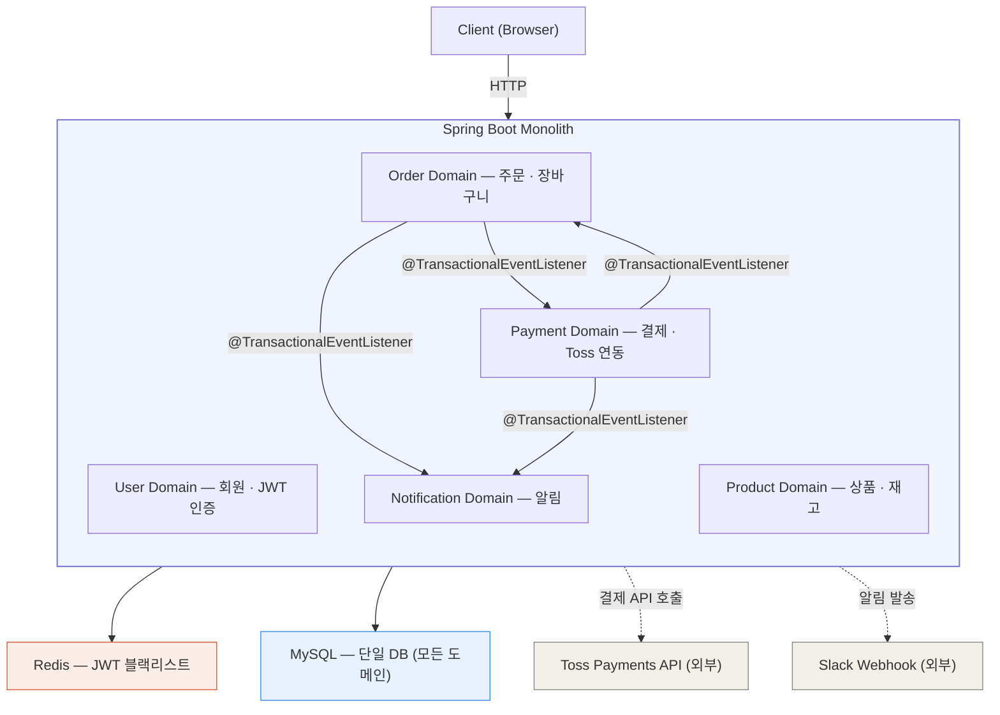
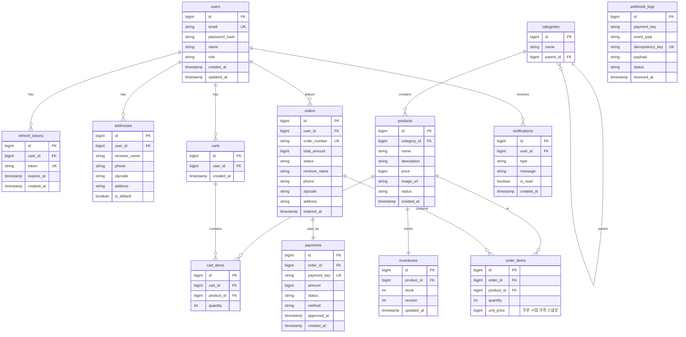
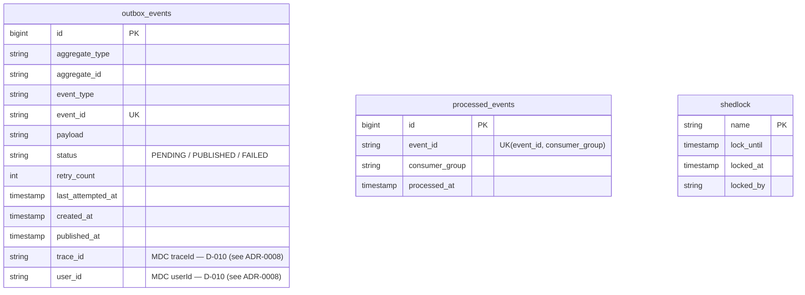

# PeekCart — Phase 1·2 설계 아카이브

> ⚠️ **아카이브 문서**: 2026-09-30 분리 (D-053). Layer 1 문서는 현재 상태만 적으므로, Phase 1 모놀리식과 Phase 2 Kafka·Outbox 도입 시점의 다이어그램·패키지 구조·ERD 를 원문 그대로 옮겼다. 이후 수정하지 않는다.
> 현재 구조는 `docs/02-architecture.md` §5 · §12 와 `docs/05-data-design.md` §11 이 정본이다.

---

## `02-architecture.md` §5 시스템 아키텍처 다이어그램

### Phase 1 — 모놀리식



> Phase 1에서는 Prometheus+Grafana를 사용하지 않습니다 (Phase 3에서 도입).
Redis는 JWT 블랙리스트 용도로만 사용합니다. 캐싱과 분산 락은 Phase 2에서 도입합니다.
>

## `02-architecture.md` §12 패키지 구조

### Phase 1 — 모놀리식 (4-Layered + DDD)

```
peekcart/
├── build.gradle
├── settings.gradle
├── docker-compose.yml
│
└── src/main/java/com/peekcart/
    ├── PeekCartApplication.java
    │
    ├── user/
    │   ├── presentation/
    │   │   ├── UserController.java
    │   │   ├── request/
    │   │   └── response/
    │   ├── application/
    │   │   ├── UserCommandService.java
    │   │   ├── UserQueryService.java
    │   │   ├── AuthService.java
    │   │   └── dto/
    │   ├── domain/
    │   │   ├── User.java               # Entity + 비즈니스 로직
    │   │   ├── RefreshToken.java
    │   │   ├── Address.java
    │   │   ├── UserRole.java           # VO (Enum)
    │   │   └── UserRepository.java     # 인터페이스만 선언
    │   └── infrastructure/
    │       ├── UserRepositoryImpl.java
    │       ├── UserJpaRepository.java
    │       └── redis/
    │           └── TokenBlacklistRepository.java  # 블랙리스트 전용
    │
    ├── product/
    │   ├── presentation/
    │   ├── application/
    │   │   ├── ProductCommandService.java
    │   │   ├── ProductQueryService.java
    │   │   └── InventoryService.java
    │   ├── domain/
    │   │   ├── Product.java
    │   │   ├── Category.java
    │   │   ├── Inventory.java          # version 필드 (낙관적 락)
    │   │   └── ProductStatus.java      # VO (Enum)
    │   └── infrastructure/
    │
    ├── order/
    │   ├── presentation/
    │   ├── application/
    │   │   ├── OrderCommandService.java
    │   │   ├── OrderQueryService.java
    │   │   └── CartService.java
    │   ├── domain/
    │   │   ├── Order.java              # 주문 상태 전이 로직 포함
    │   │   ├── OrderItem.java
    │   │   ├── OrderStatus.java        # VO (Enum)
    │   │   └── OrderRepository.java
    │   └── infrastructure/
    │       └── event/
    │           └── OrderEventListener.java  # @TransactionalEventListener
    │
    ├── payment/
    │   ├── presentation/
    │   ├── application/
    │   │   ├── PaymentCommandService.java
    │   │   └── PaymentQueryService.java
    │   ├── domain/
    │   │   ├── Payment.java
    │   │   ├── PaymentStatus.java      # VO (Enum)
    │   │   └── PaymentRepository.java
    │   └── infrastructure/
    │       ├── toss/
    │       │   └── TossPaymentClient.java
    │       └── event/
    │           └── PaymentEventListener.java  # @TransactionalEventListener
    │
    ├── notification/
    │   ├── presentation/
    │   │   └── NotificationController.java
    │   ├── application/
    │   │   ├── NotificationCommandService.java
    │   │   ├── NotificationQueryService.java
    │   │   └── port/
    │   │       └── SlackPort.java              # Slack 발송 포트 인터페이스
    │   ├── domain/
    │   │   ├── Notification.java
    │   │   └── NotificationType.java           # VO (Enum)
    │   └── infrastructure/
    │       ├── event/
    │       │   └── NotificationEventListener.java  # @TransactionalEventListener
    │       └── slack/
    │           └── SlackNotificationClient.java  # SlackPort 구현체
    │
    └── global/
        ├── config/
        │   ├── SecurityConfig.java
        │   └── RedisConfig.java
        ├── exception/
        │   ├── GlobalExceptionHandler.java
        │   ├── ErrorCode.java
        │   └── BusinessException.java
        ├── jwt/
        │   ├── JwtProvider.java
        │   └── JwtFilter.java
        └── response/
            └── ApiResponse.java
```

### Phase 2 — 패키지 변경점 (Delta)

Phase 2에서 Kafka + Outbox 패턴 도입에 따라 아래 패키지/클래스가 추가됩니다.

```
변경 사항:
│
├── order/
│   └── infrastructure/
│       ├── outbox/
│       │   └── OrderOutboxEventPublisher.java  # 비즈니스 트랜잭션 내 Outbox 저장 (NEW)
│       ├── kafka/
│       │   └── OrderEventConsumer.java         # payment.completed/failed 소비 (NEW)
│       └── event/
│           └── OrderEventListener.java         # Phase 1 유지 (Kafka 대체 대상)
│
├── payment/
│   └── infrastructure/
│       ├── outbox/
│       │   └── PaymentOutboxEventPublisher.java  # 비즈니스 트랜잭션 내 Outbox 저장 (NEW)
│       └── kafka/
│           └── PaymentEventConsumer.java       # order.created 소비 (NEW)
│
├── notification/
│   └── infrastructure/
│       └── kafka/
│           └── NotificationConsumer.java       # Kafka Consumer로 전환 (NEW)
│
└── global/
    ├── config/
    │   ├── CacheConfig.java                 # RedisCacheManager, TTL, 직렬화 (NEW)
    │   ├── KafkaConfig.java                 # Producer/Consumer/Topic 설정 (NEW)
    │   └── RedissonConfig.java              # Redisson 분산 락 설정 (NEW)
    ├── lock/                               # 분산 락 (NEW)
    │   └── DistributedLockManager.java     # Redisson 기반 락 관리자 (NEW)
    ├── kafka/
    │   ├── FixedSequenceBackOff.java       # 고정 시퀀스 BackOff 구현체 (NEW)
    │   ├── KafkaMessageParser.java         # Consumer 메시지 파싱 유틸리티 (NEW)
    │   ├── KafkaTraceHeaders.java          # Producer/Consumer trace 헤더 키 (D-007)
    │   ├── MdcRecordInterceptor.java       # Consumer MDC 주입 (D-007)
    │   ├── MdcPayloadExtractor.java        # payload 에서 traceId/userId/orderId 추출 (D-007)
    │   └── MdcSnapshot.java                # Outbox publisher 의 MDC 캡처 헬퍼 (D-010)
    ├── idempotency/
    │   ├── ProcessedEvent.java              # 중복 소비 방지 엔티티 (NEW)
    │   ├── ProcessedEventRepository.java    # 인터페이스 (NEW)
    │   ├── ProcessedEventJpaRepository.java # JPA Repository (NEW)
    │   ├── ProcessedEventRepositoryImpl.java # 구현체 (NEW)
    │   └── IdempotencyChecker.java          # 멱등성 처리기 — save-first + UK 선점 (NEW)
    └── outbox/
        ├── OutboxEvent.java                 # 횡단 관심사 — 단일 엔티티 (NEW)
        ├── OutboxEventRepository.java       # 단일 Repository (NEW)
        └── OutboxPollingScheduler.java      # Outbox Polling → Kafka 발행 (NEW)
```

### Phase 1 → Phase 4 전환 시 주요 변경점

| 항목 | Phase 1 | Phase 4 |
| --- | --- | --- |
| 프로젝트 구조 | 단일 모듈 | Gradle 멀티모듈 |
| API Gateway | 없음 | Spring Cloud Gateway |
| 결제 실패 보상 | `@TransactionalEventListener` | Choreography Saga |
| 이벤트 DTO | 도메인 내부 `infrastructure/event/` | `common` 모듈 `global/outbox/dto/` 공유 |
| Outbox | 도메인별 개별 구현 | `peekcart-common-messaging` 모듈 `global/outbox/` 공유 (발행 어댑터는 서비스 `infrastructure/outbox/`, see ADR-0033) |
| 인증 처리 | `global/jwt/` (서비스 내 JWT 필터) | `gateway` 가 사용자 JWT 검증 → 서명 내부 토큰(`X-Internal-Auth`) 주입, 서비스는 내부 토큰만 검증 (see ADR-0017) |
| 인프라 | `docker-compose.yml` + (Phase 3) `k8s/` Kustomize 단일 서비스 | `k8s/` Kustomize 서비스별 디렉토리 + Helm (kube-prometheus-stack) |
| DB 구성 | 단일 DB (모든 도메인) | DB-per-service — 5 스키마(`peekcart_<svc>`) + 계정/권한 격리, 1 인스턴스 (see ADR-0012 §D1·ADR-0016) |
| DB 마이그레이션 | Flyway (단일 DB) | Flyway (서비스별 독립 마이그레이션 `V1__init_<svc>.sql`) |

## `05-data-design.md` §11 ERD 설계

### Phase 1 — 단일 DB (모놀리식)

> 모든 도메인 테이블이 하나의 MySQL DB에 통합됩니다.
Phase 1에서는 `@TransactionalEventListener`를 사용하므로 Outbox/processed_events 테이블이 없습니다.
>



> **`order_items.unit_price` 설계 의도**: Phase 1에서도 단일 DB FK로 `products` 테이블을 조인할 수 있지만, 상품 가격이 변경되어도 주문 당시 가격을 보존하기 위해 주문 시점의 가격을 스냅샷으로 저장합니다.
**`payment_failures` 미포함 근거**: Phase 1에서는 `payments.status = 'FAILED'`로 결제 실패를 충분히 표현할 수 있으므로 별도 테이블 없이 운영합니다. 상세 실패 사유 로깅은 Phase 4에서 `payment_failures` 테이블을 도입하여 대응합니다.
>

### Phase 2 — ERD 변경점 (Delta)

Phase 2에서 Kafka + Outbox 패턴 도입에 따라 아래 테이블이 추가됩니다.



> Phase 1 → Phase 2 스키마 마이그레이션은 Flyway로 관리합니다.
`outbox_events`, `processed_events`, `shedlock` 테이블이 Phase 2에서 추가되는 스키마 변경입니다.
>

### ERD Phase 1 vs Phase 4 비교

| 항목 | Phase 1 | Phase 4 |
| --- | --- | --- |
| DB 수 | 1개 (통합) | 5개 (서비스별 분리) |
| FK 제약 | DB 레벨 FK 사용 | FK 제약 없음 (이벤트 참조) |
| 상품 정보 저장 | `product_id` FK로 조인 | 주문 시점 스냅샷 저장 |
| 결제-주문 연결 | `order_id` FK | `order_number` 이벤트 참조 |
| 데이터 정합성 | DB 트랜잭션 보장 | Saga 패턴으로 보장 |
| 이벤트 유실 방지 | 해당 없음 (로컬 이벤트) | 서비스별 DB Outbox 테이블 |
| 멱등성 처리 | 해당 없음 (로컬 이벤트) | 서비스별 DB processed_events 테이블 |
| 웹훅 중복 처리 | webhook_logs 테이블 | Payment DB webhook_logs 테이블 |
